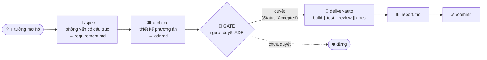
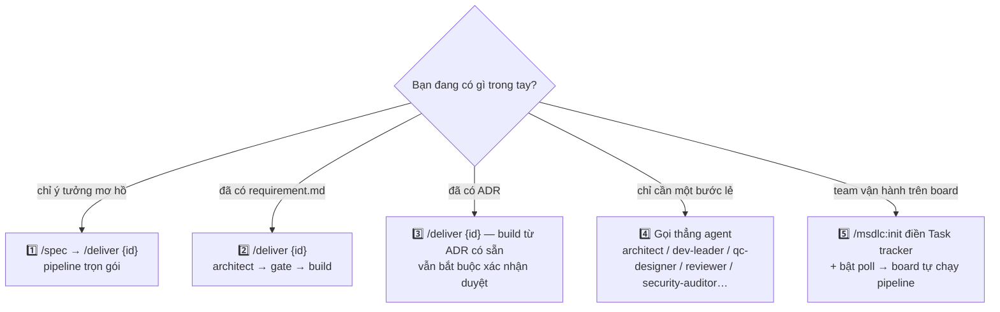
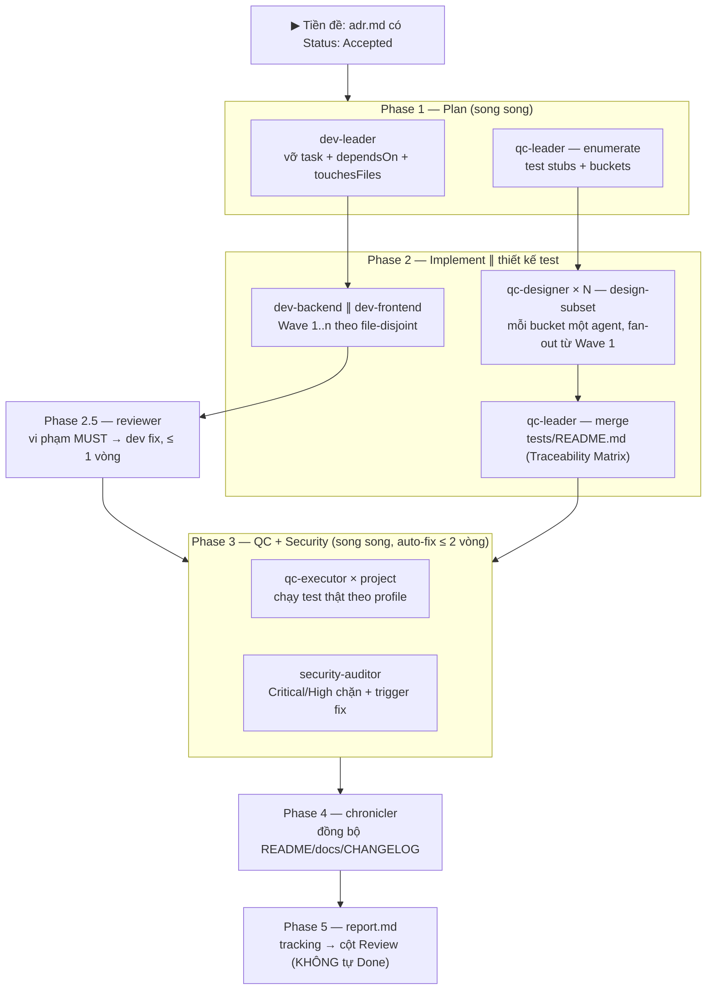
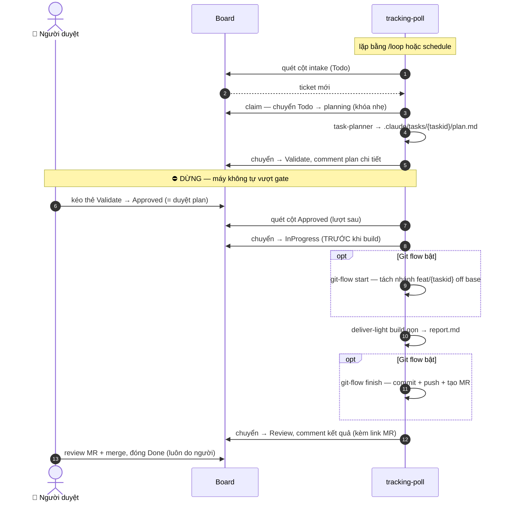

# msdlc

Một plugin Claude Code đóng gói pipeline giao hàng **độc lập stack** — với **đúng một cổng duyệt** do con người giữ:



> Chi tiết từng phase bên trong `deliver-auto` và các cách áp dụng: xem [Các workflow áp dụng](#các-workflow-áp-dụng).

Mọi đặc thù dự án **không nhúng cứng** trong agent — chúng đọc lúc chạy từ hai nguồn của dự án tiêu thụ:
- `.claude/profile.md` — **facts**: stack, đường dẫn, lệnh test, hợp đồng lockstep.
- `.claude/rules/` — **rule theo project**: convention, kiến trúc, bảo mật, Definition-of-Done, commit; chia theo scope (`global`/`backend`/`frontend`/`security`/`testing`), mỗi rule có `id` + `severity` (`MUST` chặn / `SHOULD` gợi ý). Không có rule → agent suy convention từ code lân cận như cũ.

## Thành phần

### Agents

Mỗi agent là một vai trò AI chuyên biệt — được gọi qua `Agent tool` bởi skill hoặc main agent điều phối.

| Agent | Vai trò |
|---|---|
| `architect` | Đọc `requirement.md`, thiết kế phương án kỹ thuật, ghi `adr.md` và cập nhật `docs/architecture.md`. |
| `task-planner` | (luồng board nhẹ) Phân tích một task nhỏ từ board dựa trên codebase hiện tại, ghi `plan.md` (phương án + subtask file-disjoint + files đụng + acceptance) ra `.claude/tasks/{taskid}/`. Bản nhẹ của `architect`; không tạo ADR/docs, không viết code. |
| `dev-leader` | Đọc `adr.md` + `requirement.md`, vỡ thành danh sách task atomic có dependency graph, ghi ra `tasks/`. |
| `dev-backend` | Implement code server-side (bất kỳ ngôn ngữ/framework theo profile): service, controller, repository, migration, API endpoint… |
| `dev-frontend` | Implement UI web theo task spec — đọc profile để biết framework/component convention của dự án. |
| `qc-leader` | Điều phối thiết kế test theo map/reduce: *enumerate* (liệt kê test-case stub + chia bucket cân bằng + coverage) và *merge* (gộp các part → Traceability Matrix + Coverage & Gaps ở `tests/README.md`). Đối xứng với `dev-leader`. |
| `qc-designer` | Thiết kế test case (positive/negative/boundary/edge) từ spec + ADR, ghi ra `tests/`. Chế độ *design-subset*: flesh-out một bucket stub do `qc-leader` giao (fan-out song song); chế độ *full*: tự làm trọn gói khi gọi lẻ. |
| `qc-executor` | Chạy test suite thực tế bằng lệnh trong profile, báo pass/fail/infraMissing, auto-fix ≤2 vòng. |
| `reviewer` | Review diff theo nhiều chiều (đúng spec, lockstep, logic, convention & **rule dự án**, test alignment, readability); vi phạm rule `MUST` → blocking (kèm `ruleId`). Trả verdict có cấu trúc. |
| `security-auditor` | Audit diff tìm lỗ hổng bảo mật (injection, auth/authz, secrets leak, crypto, SSRF, XSS/CSRF, IDOR…) **và rule `R-SEC-*`**, auto-fix Critical/High ≤2 vòng. |
| `chronicler` | Đồng bộ README/docs/docstring/inline comment với code vừa thay đổi — không tự thêm tính năng chưa có trong code. |

### Skills

Skills là lệnh `/tên` người dùng gọi trực tiếp trong Claude Code.

| Skill | Lệnh | Mô tả |
|---|---|---|
| `spec` | `/spec` | Phỏng vấn có cấu trúc để biến ý tưởng còn mơ hồ thành `requirement.md` rõ ràng (mục tiêu, scope, AC, ràng buộc). |
| `deliver` | `/deliver {id}` | Chạy toàn bộ pipeline cho một story: architect → **[GATE duyệt ADR]** → deliver-auto. |
| `deliver-auto` | (nội bộ) | Điều phối Phase 1–5 sau khi ADR đã duyệt: (dev-leader ∥ qc-leader enumerate) → dev (song song) ∥ qc-designer ×N (fan-out từ Wave 1) → qc-leader merge → reviewer → qc-executor + security-auditor → chronicler. |
| `deliver-light` | (nội bộ) | **Build GỌN** cho task board nhỏ đã có `plan.md` duyệt: implement song song theo subtask file-disjoint (dev-backend/dev-frontend) → reviewer → qc-executor + security-auditor → chronicler → `report.md`. Không vỡ task bằng dev-leader, không QC map/reduce. Gọi bởi `tracking-poll`. |
| `tracking` | `/msdlc:tracking {id} {phase} [kind]` | Đồng bộ trạng thái sang cột board ngoài (Jira/Asana/Linear/Monday) tại một mốc (`todo`/`planning`/`validate`/`approved`/`in-progress`/`review`). `kind` ∈ `story` (mặc định, luồng thủ công — artifact `.claude/stories/`, comment ADR) \| `task` (luồng board nhẹ — artifact `.claude/tasks/`, comment plan). Được `spec`/`deliver`/`deliver-auto`/`tracking-poll` gọi tự động; tự **no-op** nếu dự án không cấu hình tracker. Không bao giờ tự chuyển Done. |
| `git-flow` | `/msdlc:git-flow {taskid} {start\|finish}` | (luồng board, opt-in) Tách nhánh riêng cho mỗi task từ base branch (`start`), build xong thì một commit (qua `msdlc:commit`) + push + tạo MR/PR + trả link để comment vào ticket (`finish`). Auto-create MR qua `gh`/`glab` nếu có, không thì fallback link tạo MR tay. Tự **no-op** nếu tắt cờ / không phải git repo. **Máy không bao giờ tự merge.** |
| `commit` | `/commit` | Tạo git commit tuân thủ quy ước commit của dự án (`.claude/rules/global.md` nhóm `## Commit`); mặc định msdlc: `(type): description` + khai báo `Co-Authored-By` khi có AI hỗ trợ. |

### Commands

Commands là lệnh `/plugin:tên` dùng để setup — thường chỉ chạy một lần trên mỗi dự án.

| Command | Lệnh | Mô tả |
|---|---|---|
| `init` | `/msdlc:init` | Copy `agent-memory.md` + tạo `profile.md` + `.claude/rules/` vào `.claude/` của dự án, tự dò stack điền profile và auto-seed rule từ config sẵn có. |
| `tracking-poll` | `/msdlc:tracking-poll` | Quét board ngoài **một lượt** và tự khởi động **luồng nhẹ** cho ticket đang chờ: ticket ở cột intake → claim (Todo→planning) + `task-planner` phân tích + comment plan chi tiết → đẩy sang Validate rồi **dừng**; ticket ở cột Approved (do người kéo) → chuyển in-progress rồi build gọn (`deliver-light`) → Review. Dùng cùng `/loop` hoặc `schedule` để chạy định kỳ. Opt-in (cờ poll trong profile). |

### Hooks

Hooks tự động đăng ký qua `plugin.json` — không cần cấu hình thêm.

| Hook | Trigger | Mô tả |
|---|---|---|
| `block-read-secrets.sh` | `Read` | Chặn đọc `.env*`, file khóa/cert (`.pem`, `.key`, `.p12`…), tên file rõ là secrets, SSH/cloud credentials. |
| `block-bash-dangerous.sh` | `Bash` | Chặn fork bomb, `rm -rf` hệ thống, pipe-to-shell từ internet, `git push --force` lên main/master, lệnh SQL phá hủy schema, và đọc secrets qua shell. |

### Shared

File dùng chung — copy vào `.claude/` của dự án tiêu thụ khi init.

| File | Mô tả |
|---|---|
| `shared/agent-memory.md` | Giao thức memory ~140 dòng dùng chung cho mọi agent — định nghĩa cách đọc/ghi/cập nhật memory cục bộ. |
| `shared/profile.template.md` | Mẫu `profile.md` — nguồn sự thật cho *facts* của dự án (stack, lệnh build/test, lockstep). |
| `shared/rules/*.md` | Mẫu `.claude/rules/` — nguồn *rule* theo project (`global`/`backend`/`frontend`/`security`/`testing`); mỗi rule có `id` + `severity`. |

## Cài đặt

### Bước 1 — Cài plugin

**Từ GitHub (khuyên dùng):** add marketplace trước, rồi install theo `plugin@marketplace`:
```
/plugin marketplace add minhhv08/msdlc
/plugin install msdlc@minhhv
```
> `minhhv` là tên marketplace (trường `name` trong `.claude-plugin/marketplace.json`), `msdlc` là tên plugin. Lưu ý `/plugin install github:...` KHÔNG hợp lệ — phải add marketplace trước.
> Tương đương ngoài phiên tương tác: `claude plugin marketplace add minhhv08/msdlc && claude plugin install msdlc@minhhv`.

**Hoặc từ local** (nếu đã clone về máy):
```
/plugin marketplace add ~/claude-plugins
/plugin install msdlc@minhhv
```

### Bước 2 — Cấu hình dự án

Chạy một lần trong mỗi dự án muốn dùng pipeline:
```
/msdlc:init
```

Lệnh này copy `agent-memory.md` + tạo `profile.md` + `.claude/rules/` vào `.claude/`, tự dò stack điền profile và auto-seed rule từ config sẵn có (CLAUDE.md/CONTRIBUTING/.editorconfig/linter).

<details>
<summary>Làm thủ công nếu không dùng lệnh init</summary>

```bash
# <msdlc> = đường dẫn tới plugin: repo đã clone (github.com/minhhv08/msdlc),
# hoặc bản đã cài (tìm dưới ~/.claude/plugins/). Trong phiên Claude Code, biến
# $CLAUDE_PLUGIN_ROOT trỏ sẵn tới đây khi chạy command của plugin.
mkdir -p .claude/shared .claude/rules
cp "<msdlc>/shared/agent-memory.md" .claude/shared/agent-memory.md
cp "<msdlc>/shared/profile.template.md" .claude/profile.md
cp "<msdlc>"/shared/rules/*.md .claude/rules/
```

Rồi **điền `.claude/profile.md`** (stack, đường dẫn, lệnh build/test, hạ tầng, hợp đồng lockstep) và **`.claude/rules/`** (convention, kiến trúc, bảo mật, DoD, commit).

</details>

> **Vì sao phải copy file vào `.claude/`?** Subagent đọc file theo đường dẫn tương đối từ gốc dự án. Agent tham chiếu `.claude/profile.md`, `.claude/rules/` và `.claude/shared/agent-memory.md` — nên chúng phải tồn tại trong `.claude/` của dự án tiêu thụ. `profile.md` + `rules/` là per-project; `agent-memory.md` là bản giao thức dùng chung copy về.

### Bước 3 — Gitignore (tùy chọn)

Thêm vào `.gitignore` của dự án tiêu thụ:
```
.claude/agent-memory-local/
.claude/stories/
.claude/tasks/
```

> `.claude/stories/` (luồng thủ công) và `.claude/tasks/` (luồng board nhẹ) là artifact local per-máy — không commit (tránh link chết trên máy khác).

> `.claude/profile.md` và `.claude/rules/` thì **nên commit** — đây là cấu hình dùng chung cho cả team.

## Các workflow áp dụng

Chọn workflow theo **thứ bạn đang có trong tay**:



### 1️⃣ Trọn gói — từ ý tưởng mơ hồ

```
/spec          → phỏng vấn → .claude/stories/{id}/requirement.md
/deliver {id}  → architect → [GATE duyệt ADR] → build + test + docs → report.md
```

Dùng khi mới chỉ có ý tưởng, chưa có PRD. `/spec` ép làm rõ scope, non-goals, acceptance criteria trước khi đụng tới thiết kế.

### 2️⃣ Từ requirement có sẵn

Đã có `requirement.md` (tự viết theo template, hoặc do `tracking-poll` suy từ ticket)? Chạy thẳng `/deliver {id}` — pipeline bắt đầu từ bước architect.

### 3️⃣ Build từ ADR có sẵn

Nói với `/deliver {id}`: *"build luôn từ ADR có sẵn"* — bỏ qua bước thiết kế nhưng **không bỏ qua gate**: vẫn phải xác nhận duyệt một lần (skill ghi `Status: Accepted` vào `adr.md` rồi mới build).

### 4️⃣ Chạy lẻ từng bước

Mỗi agent dùng độc lập được qua Agent tool khi chỉ cần một mắt xích:

| Bạn nói | Agent chạy |
|---|---|
| "Thiết kế kiến trúc cho story 002" | `architect` |
| "Vỡ task từ ADR của story 002" | `dev-leader` |
| "Thiết kế test case cho requirement này" | `qc-designer` (chế độ full) |
| "Review diff hiện tại" | `reviewer` |
| "Quét bảo mật diff này trước khi merge" | `security-auditor` |
| "Chạy test cho project X" | `qc-executor` |
| "Sync docs với code vừa đổi" | `chronicler` |

### 5️⃣ Vận hành theo board — tự động hoá cao nhất

Điền mục `## Task tracker` trong profile + bật cờ poll → board Jira/Asana/Linear/Monday trở thành giao diện vận hành pipeline: kéo thẻ là duyệt, máy lo phần còn lại. Xem [Đồng bộ board ngoài](#đồng-bộ-board-ngoài-tùy-chọn).

### Bên trong deliver-auto (Phase 1 → 5)

Sau khi ADR được duyệt, `deliver-auto` tự điều phối các agent — song song tối đa những việc không đụng file nhau:



Ba trục song song hoá chính:

- **Wave file-disjoint** — các dev task có `touchesFiles` rời nhau chạy cùng lúc; đụng file chung thì xếp wave sau.
- **Map/reduce thiết kế test** — `qc-leader` liệt kê stub + chia bucket ngay ở Phase 1, N `qc-designer` flesh-out song song với dev từ Wave 1, `qc-leader` merge lại; đến Phase 3 test suite đã sẵn.
- **QC ∥ Security** — mỗi project một `qc-executor`, chạy cùng lúc với `security-auditor`; lỗi test hoặc finding Critical/High → dev fix rồi chạy lại, ngân sách chung ≤ 2 vòng.

## Đồng bộ board ngoài (tùy chọn)

Nếu dự án dùng board (Jira/Asana/Linear/Monday), msdlc có thể tự chuyển cột ticket theo tiến độ pipeline. **Tính năng opt-in**: không cấu hình mục `## Task tracker` trong `.claude/profile.md` → pipeline chạy thuần local **y như cũ** (skill `msdlc:tracking` tự no-op).

Ánh xạ mốc pipeline → cột board (tên cột cấu hình được trong profile; ví dụ theo flow phổ biến) — 🤖 là máy tự chuyển, 👤 là thao tác của người:

```mermaid
flowchart LR
    B["Backlog"] --> T["Todo (intake)"]
    T -->|"🤖 poll: claim → planning"| PL["Planning"]
    PL -->|"🤖 task-planner → plan + comment"| V["Validate"]
    V -->|"👤 kéo thẻ = duyệt plan"| A["Approved"]
    A -->|"🤖 poll: in-progress → build gọn"| I["InProgress"]
    I -->|"🤖 xong deliver-light"| R["Review"]
    R -->|"👤 verify + đóng"| D["Done"]
    style V fill:#fff3cd,stroke:#b8860b
    style A fill:#fff3cd,stroke:#b8860b
    style D fill:#d4edda,stroke:#2e7d32
```



- **Poll chạy luồng NHẸ** (task board là feat/fixbug nhỏ): dùng `.claude/tasks/{taskid}/` + agent `task-planner` (không phải `architect`) + `plan.md` (không phải ADR) + `deliver-light` (không phải `deliver-auto`). Luồng thủ công `/spec`+`/deliver` (dùng `.claude/stories/` + ADR + `deliver-auto`) vẫn giữ nguyên cho việc lớn.
- **Vòng sửa plan + trả lời qua comment** (poll đọc comment ticket): muốn sửa plan → comment yêu cầu rồi **kéo thẻ về Todo** → poll cập nhật `plan.md` (revision) và đưa lại Validate chờ duyệt. Muốn duyệt kèm làm rõ → **trả lời các Open question trong comment** rồi kéo sang Approved → poll fold câu trả lời vào plan trước khi build (không quay lại Validate).
- `planning` là bước **claim/lock**: poll chuyển `Todo → planning` để nhận ticket TRƯỚC khi phân tích — ticket rời cột intake nên session khác không nhận trùng (khóa nhẹ; nên chạy một poller cho mỗi board).
- Giữa hai khúc tự động là **cổng duyệt** — thao tác **người kéo thẻ** từ `Validate` sang `Approved` (= duyệt bản plan đã comment). Máy không bao giờ tự vượt.
- `Done` **không bao giờ** do máy chuyển — luôn để người verify và đóng thủ công.

### Tự động kéo task từ board (loop)

`/msdlc:tracking-poll` quét board **một lượt** theo luồng nhẹ: ticket ở cột intake → claim (Todo→planning) + `task-planner` phân tích + comment plan → đẩy sang `Validate` rồi dừng; ticket ở cột `Approved` (người đã duyệt) → chuyển in-progress rồi build gọn → `Review`. Mỗi lượt còn có **bước resume** nhặt lại task kẹt ở `planning`/`in-progress` do lượt trước fail. Một chu trình đầy đủ của một ticket:



**Git flow (tùy chọn — mục `## Git` trong profile, mặc định tắt):** khi bật, mỗi task board làm trên **một nhánh riêng** tách từ base branch (main/master/production — cấu hình được), build xong tự **commit → push → tạo MR/PR → comment link MR vào ticket**. Chỉ **một build/lượt** để không juggle nhiều nhánh trên working tree chung. Máy tạo MR nhưng **không bao giờ tự merge** — người review MR rồi merge + đóng ticket (đối xứng "Done do người"). Tắt cờ → poll build thẳng trên branch hiện tại như cũ. Chi tiết: skill `msdlc:git-flow`.

Để chạy định kỳ, ghép với cơ chế lặp của harness (msdlc không tự chế scheduling):

- **`/loop 10m /msdlc:tracking-poll`** — lặp theo interval trong phiên đang mở. Đơn giản; dừng khi đóng phiên/máy.
- **`schedule`** (cloud cron) — tạo scheduled agent chạy nền kể cả khi tắt máy. Bền hơn cho vận hành liên tục.

Bật poll là tự động mạnh → phải bật cờ `poll` trong profile (mặc định tắt). Dù bật, loop **vẫn giữ cổng duyệt**: chỉ tự build ticket đã được người kéo sang `Approved`.

## Hooks bảo mật

Plugin đăng ký hai `PreToolUse` hook tự động — không cần cấu hình thêm:

| Hook | Trigger | Bảo vệ |
|---|---|---|
| `block-read-secrets.sh` | `Read` | Chặn đọc `.env*`, file khóa/cert (`.pem`, `.key`, `.p12`…), tên file rõ là secrets (`*password*`, `*api_key*`…), SSH/cloud credentials (`~/.ssh/`, `~/.aws/credentials`…) |
| `block-bash-dangerous.sh` | `Bash` | Chặn đọc secrets qua shell (`cat .env`…), fork bomb, `rm -rf` hệ thống, ghi thiết bị (`dd`, `mkfs`), pipe-to-shell từ internet, `git push --force` lên main/master, `git reset --hard` nhiều commit, lệnh SQL phá hủy schema (`DROP DATABASE`, `TRUNCATE TABLE`), `chmod 777` thư mục hệ thống |

Hook exit 1 → Claude Code hủy lệnh tương ứng và hiện thông báo `[msdlc] BLOCKED: ...`.

---

## Từ khóa & thuật ngữ

| Thuật ngữ | Mô tả |
|---|---|
| **plugin** | Gói mở rộng cài vào Claude Code, đóng gói sẵn agents/skills/hooks để tái dùng qua nhiều dự án. |
| **agent** | Một vai trò AI chuyên biệt (file `.md`) — nhận nhiệm vụ, đọc context, thực thi, trả kết quả. Main agent gọi agent khác qua `Agent tool`. |
| **skill** | Lệnh `/tên` do người dùng gọi trực tiếp trong Claude Code. Skill điều phối nhiều agent để hoàn thành một luồng lớn (vd `/deliver`). |
| **command** | Lệnh `/plugin:tên` dùng để cài đặt/cấu hình một lần (vd `/msdlc:init`). Khác skill ở chỗ thường chỉ chạy một lần khi setup. |
| **hook** | Script shell tự động chạy trước/sau khi Claude Code dùng một tool (vd trước `Bash`, `Read`). Plugin đăng ký hook qua `plugin.json`. |
| **profile** | File `.claude/profile.md` trong *dự án tiêu thụ* — chứa *facts* của dự án: stack, lệnh build/test, hợp đồng lockstep. Agents đọc file này thay vì hardcode. |
| **rules** | Thư mục `.claude/rules/` trong *dự án tiêu thụ* — *rule theo project* (convention, kiến trúc, bảo mật, Definition-of-Done, commit), chia theo scope. Mỗi rule có `id` + `severity` (`MUST` chặn / `SHOULD` gợi ý); `reviewer`/`security-auditor` enforce. Trống → suy convention từ code lân cận. |
| **ruleId** | Định danh một rule trong `.claude/rules/` (vd `R-BE-1`, `R-SEC-2`). `reviewer`/`security-auditor` gắn `ruleId` vào finding để truy vết về rule bị vi phạm. |
| **agent-memory** | Cơ chế agent ghi nhớ context giữa các lần chạy, lưu trong `.claude/agent-memory-local/<tên-agent>/`. Giao thức định nghĩa tại `shared/agent-memory.md`. |
| **story** | (luồng thủ công) Một feature/yêu cầu cụ thể, id dạng số thứ tự (vd `001`). Mọi artifact nằm trong `.claude/stories/{id}/`. Đi qua `/spec`→`/deliver`→`deliver-auto` với gate ADR. |
| **task (board)** | (luồng board nhẹ) Một feat/fixbug nhỏ từ board ngoài, `taskid` = ID ticket (vd `PROJ-123`). Artifact ở `.claude/tasks/{taskid}/` (`plan.md`/`report.md`). Đi qua `tracking-poll`→`task-planner`→`deliver-light` với gate là kéo thẻ sang Approved. |
| **ADR** | *Architecture Decision Record* — tài liệu quyết định thiết kế do `architect` tạo ra (`adr.md`). Phải được user duyệt trước khi pipeline tự động chạy tiếp. |
| **requirement** | File `requirement.md` do `/spec` tạo ra — mô tả yêu cầu có cấu trúc (mục tiêu, scope, AC, ràng buộc). |
| **lockstep** | Hợp đồng đồng bộ giữa các project (vd migration phải chạy trước khi deploy service phụ thuộc). Mô tả trong `profile.md`, agents tôn trọng khi implement. |
| **wave** | Một đợt dev agents chạy song song trong Phase 2 — gồm các task có `touchesFiles` rời nhau nên không xung đột file. |
| **file-disjoint** | Điều kiện để hai task có thể chạy song song: tập file chúng đụng tới không giao nhau. |
| **auto-fix** | Agent tự sửa lỗi trong ngân sách giới hạn (reviewer ≤1 vòng, qc-executor + security-auditor ≤2 vòng) trước khi dừng và báo cáo. |
| **infraMissing** | Trạng thái `qc-executor` báo khi hạ tầng test chưa sẵn sàng (DB chưa up, service phụ thuộc chưa chạy…) — không tự fix được, báo trung thực. |
| **consuming project** | Dự án *dùng* plugin này (khác với repo plugin). Phải có `.claude/profile.md` và `.claude/shared/agent-memory.md` để agents hoạt động. |
| **GATE** | Điểm dừng duy nhất yêu cầu user xác nhận thủ công. Luồng thủ công: sau khi `architect` tạo xong ADR. Luồng board: sau khi `task-planner` comment plan (ticket ở `Validate`) — gate = thao tác người kéo thẻ `Validate`→`Approved`. |
| **tracker sync** | Cơ chế đồng bộ trạng thái story/task ↔ cột board ngoài, gom trong skill `msdlc:tracking` (tham số `kind` = `story`\|`task`). Opt-in qua mục `## Task tracker` của `profile.md`; tự no-op khi không cấu hình; không bao giờ tự chuyển Done. |
| **poll** | Lệnh `/msdlc:tracking-poll` quét board một lượt, tự khởi động **luồng nhẹ** cho ticket ở cột intake/Approved (claim Todo→planning → `task-planner` → plan → build gọn bằng `deliver-light`). Lặp bằng `/loop` hoặc `schedule`. Opt-in (cờ `poll` trong profile), vẫn giữ cổng duyệt. |
| **git flow** | (opt-in, mục `## Git` profile) Luồng poll tách một nhánh/task từ base branch, build xong commit + push + tạo MR/PR + comment link vào ticket. Gom trong skill `msdlc:git-flow`; auto-create MR qua `gh`/`glab` hoặc fallback link tạo tay. Một build/lượt; **máy không tự merge** (người merge + đóng ticket). Tắt = build thẳng branch hiện tại như cũ. |

---

## Thiết kế "sạch hardcode"

- Agent chỉ giữ **vai trò + quy trình**; *facts* dự án nằm trong `profile.md`, *rule* dự án nằm trong `.claude/rules/`.
- `dev-backend` phục vụ mọi ngôn ngữ/framework backend (tự nhận diện theo file đụng tới); `dev-frontend` phục vụ UI web.
- Giao thức memory ~140 dòng gom 1 bản tại `shared/agent-memory.md` thay vì lặp trong từng agent.
- Rule là *cấu hình per-project*, không phải prompt: thêm/sửa rule trong dự án tiêu thụ không cần đụng định nghĩa agent. Dự án chưa có `.claude/rules/` chạy y hệt như trước.
