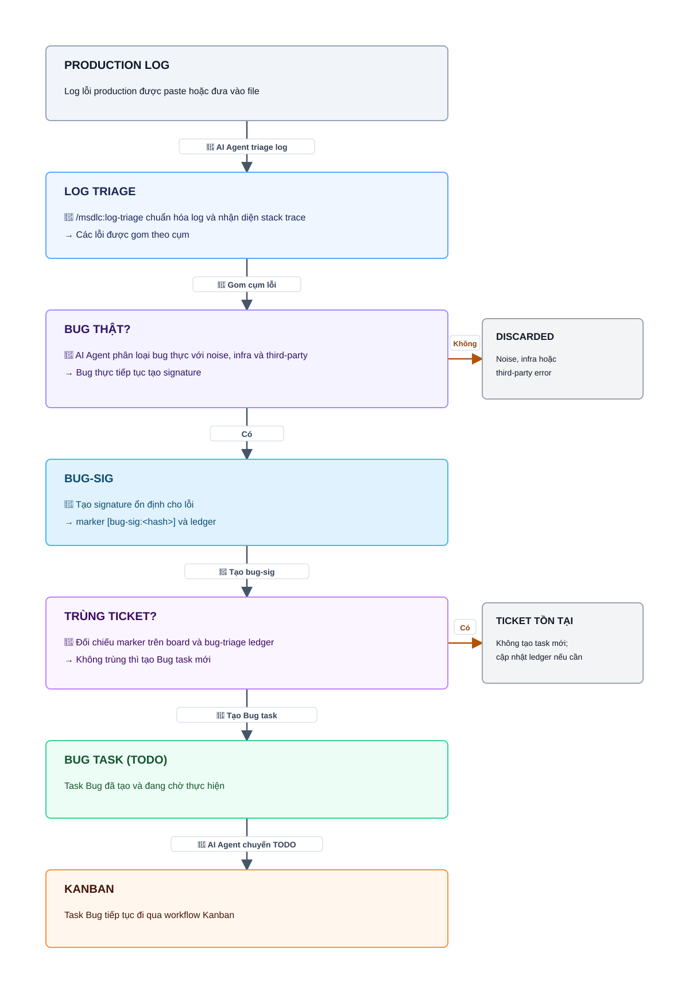
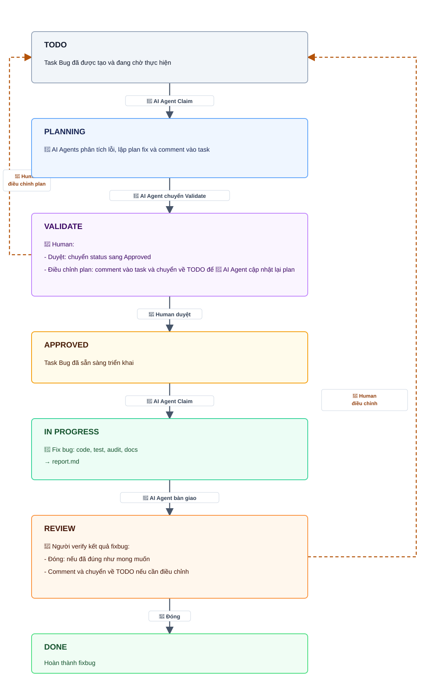

# Workflow: Fixbug từ log

Dùng khi có production log và muốn biến các lỗi thật thành ticket Bug dedup trên board.

## Fixbug qua Kanban

Checkpoint chính:

- `log-triage` chỉ làm intake: gom lỗi, lọc noise, tạo ticket Bug.
- Dedup dùng hai lớp: marker `[bug-sig:<hash>]` trên board và ledger `.claude/bug-triage/ledger.md`.
- Bug mới luôn vào cột Todo/Intake; không tự build ngay.
- Việc fix tiếp theo đi qua workflow Kanban và vẫn giữ gate `Validate -> Approved`.
- Máy không tự duyệt, không tự merge, không tự đóng Done.
