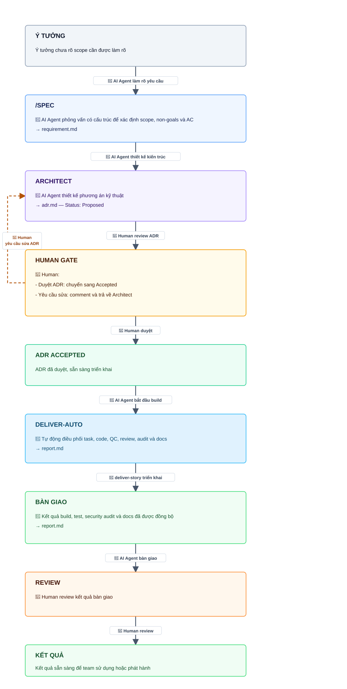
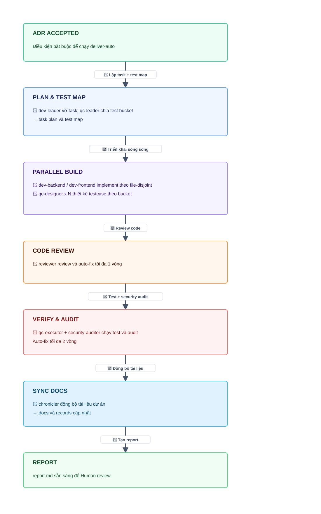

# Workflow: Từ ý tưởng đến kết quả

Dùng khi bắt đầu từ một ý tưởng chưa rõ scope và muốn đi trọn vòng đến kết quả có thể review.

## Chi tiết deliver-auto

Checkpoint chính:

- `/spec` tạo `.claude/stories/{id}/requirement.md`.
- `architect` tạo `.claude/stories/{id}/adr.md`.
- Chỉ có một gate bắt buộc: người duyệt ADR.
- `deliver-auto` chỉ chạy khi ADR có `Status: Accepted`.
- Máy không tự commit; nếu cần commit thì gọi `msdlc:commit`.
