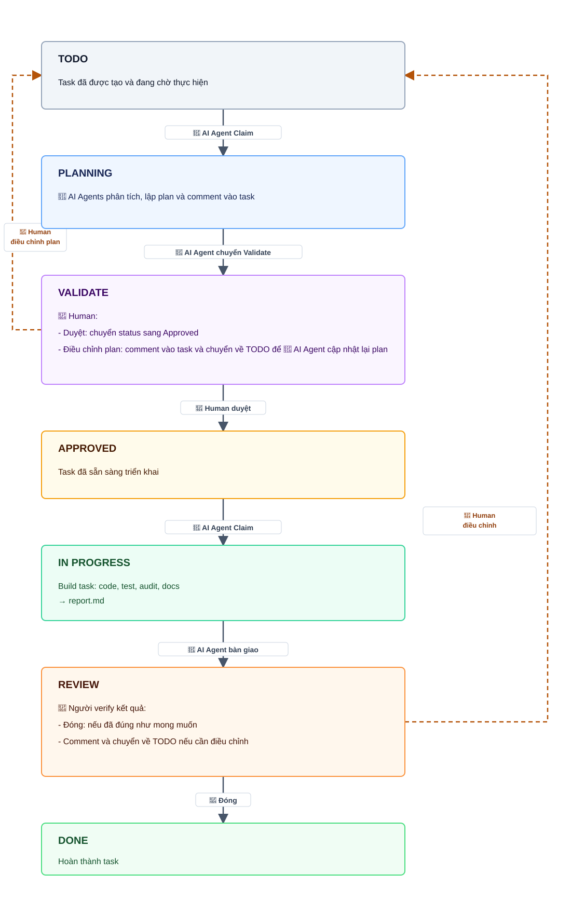
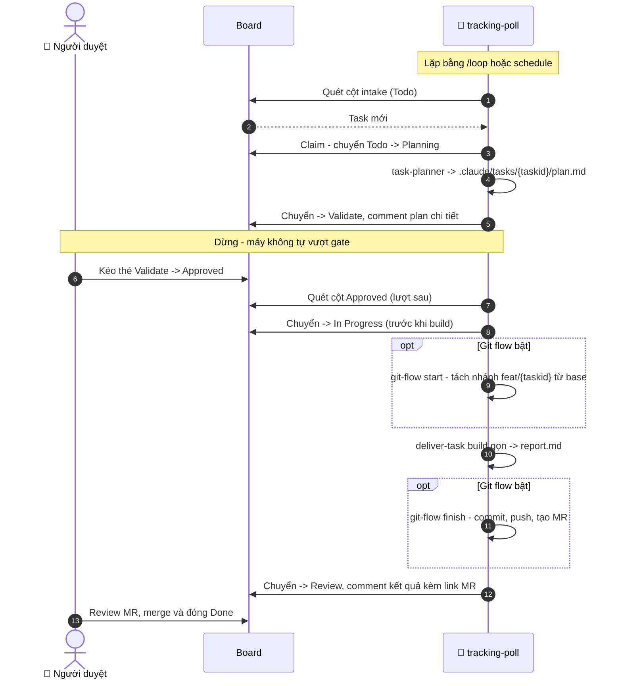

# Workflow: Vận hành theo Kanban Board

Dùng khi team muốn board là giao diện điều phối: máy nhận ticket, lập plan, chờ duyệt, build task đã duyệt, rồi đưa sang Review.

## Trạng thái trên board

## Đồng bộ board ngoài (tùy chọn)

Nếu dự án dùng board (Jira/Asana/Linear/Monday/Notion), msdlc có thể tự chuyển cột ticket theo tiến độ pipeline. Đây là tính năng opt-in: không cấu hình mục `## Task tracker` trong `.claude/profile.md` thì pipeline chạy thuần local như cũ (skill `msdlc:tracking` tự no-op).

Ánh xạ mốc pipeline → cột board (tên cột cấu hình được trong profile; 🤖 là máy tự chuyển, 👤 là thao tác của người):

```mermaid
flowchart LR
    B["Backlog"] --> T["Todo"]
    T -->|"🤖 poll: claim → Planning"| PL["Planning"]
    PL -->|"🤖 task-planner → plan + comment"| V["Validate"]
    V -->|"👤 kéo thẻ = duyệt plan"| A["Approved"]
    A -->|"🤖 poll: In Progress → build gọn"| I["In Progress"]
    I -->|"🤖 xong deliver-task"| R["Review"]
    R -->|"👤 verify + đóng"| D["Done"]
    style V fill:#fff3cd,stroke:#b8860b
    style A fill:#fff3cd,stroke:#b8860b
    style D fill:#d4edda,stroke:#2e7d32
```

- **Poll chạy luồng nhẹ**: dành cho feat/fixbug nhỏ trên board, dùng `.claude/tasks/{taskid}/`, `task-planner`, `plan.md` và `deliver-task`. Luồng `/spec` + `/deliver` dùng stories, ADR và `deliver-story` cho việc lớn.
- **Vòng sửa plan qua comment**: comment yêu cầu rồi kéo thẻ về `Todo`; poll cập nhật `plan.md` và đưa lại `Validate`. Muốn duyệt kèm làm rõ thì trả lời Open question trong comment rồi kéo sang `Approved`; poll fold câu trả lời vào plan trước khi build.
- **Cột board là nguồn sự thật**: task kéo về `Todo` luôn được reopen, kể cả từng ở `Review`; poll archive report cũ, cập nhật plan và đưa lại `Validate`. Poll cần MCP tool của connector trong `allowed-tools` để đọc cột và comment.
- **Planning là claim/lock**: poll chuyển `Todo → Planning` trước khi phân tích để session khác không nhận trùng; nên chạy một poller cho mỗi board.
- **Gate bắt buộc**: người kéo thẻ `Validate → Approved` để duyệt plan. Máy không bao giờ tự vượt gate.
- **Done do người**: máy không tự chuyển `Done`.

## Tự động kéo task từ board (loop)

`/msdlc:tracking-poll` quét board **một lượt** theo luồng nhẹ: ticket ở cột intake → claim (`Todo → Planning`) + `task-planner` phân tích + comment plan → đẩy sang `Validate` rồi dừng; ticket ở cột `Approved` (do người kéo) → chuyển `In Progress` rồi build gọn → `Review`. Mỗi lượt còn có **bước resume** nhặt lại task kẹt ở `Planning` hoặc `In Progress` do lượt trước fail.

**Git flow** (tùy chọn, mục `## Git` trong profile; mặc định tắt): trước mỗi lần phân tích, poll gọi `git-flow sync` để pull đúng nhánh. Task chưa có nhánh riêng dùng nhánh base cấu hình; task đã có nhánh riêng thì pull chính nhánh task. Mỗi task build trên một nhánh riêng từ base branch; build xong máy commit, push, tạo MR/PR và comment link vào ticket. Các git op làm lần lượt từng task; máy tạo MR nhưng không tự merge.

Để chạy định kỳ, ghép với cơ chế lặp của harness:

- `/loop 10m /msdlc:tracking-poll`: lặp theo interval trong phiên đang mở; dừng khi đóng phiên hoặc máy.
- `schedule`: tạo scheduled agent chạy nền kể cả khi tắt máy, phù hợp vận hành liên tục.

Bật poll là tự động mạnh nên phải bật cờ `poll` trong profile (mặc định tắt). Dù bật, loop vẫn giữ cổng duyệt: chỉ tự build task đã được người kéo sang `Approved`.

Checkpoint chính:

- Bật `## Task tracker` và có cấu hình cột trong `.claude/profile.md`.
- `/msdlc:tracking-poll` là one-shot; lặp bằng `/loop` hoặc scheduler bên ngoài.
- Gate của luồng board là thao tác người kéo thẻ `Validate -> Approved`.
- `deliver-task` không tạo ADR, không map/reduce QC đầy đủ; nó build gọn theo `plan.md`.
- Máy không bao giờ tự chuyển `Done`.
